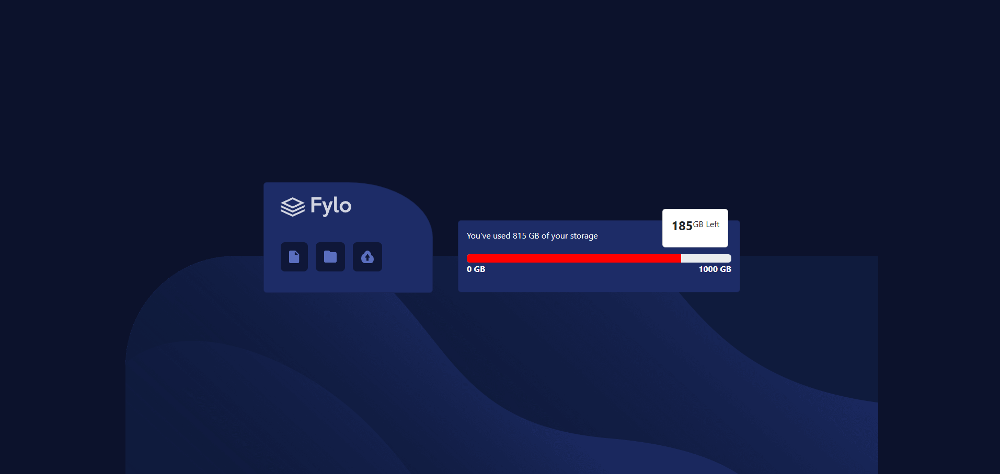

# Frontend Mentor - Fylo data storage component

## Welcome! 👋

Thanks for checking out this front-end coding challenge.

[Fylo Data Storage Component Challenge](https://www.frontendmentor.io/challenges/fylo-data-storage-component-1dZPRbV5n)

## The challenge

My challenge was to implement a high-fidelity Figma design from a selection available to you through Frontend Mentor.

The focus was on the implementation of the challenge’s design, not its functionality.

A combination of HTML, CSS, and Bootstrap was required to implement the design.

I chose to go with the Fylo Data Storage Component challenge.

## Approach

I tackled this assignment by creating several sections of components under a parent **div** tag.

There are two major components inside of the parent **div**: one left and one right.

From there I begin creating the singular components for the left and right, then implemented whatever designs I could using HTML.

After I was mostly done with the HTML, I went to the CSS and started adding styles.

Most of styling was somewhat random, but once implemented I viewed the project to see whether I wanted to go with that styling or not.

## Challenges

The biggest challenge to this project was implementing the Bootstrap styling using the built-in classes and styling.

Although I was unable to perfect the challenge, I did manage to get it looking well.

I relied heavily on using the browser dev tools to help me with viewing changes in real-time.

Lastly, I had to not only review, but also study additional parts of the Bootstrap Documentation to help me with utilizing it.
